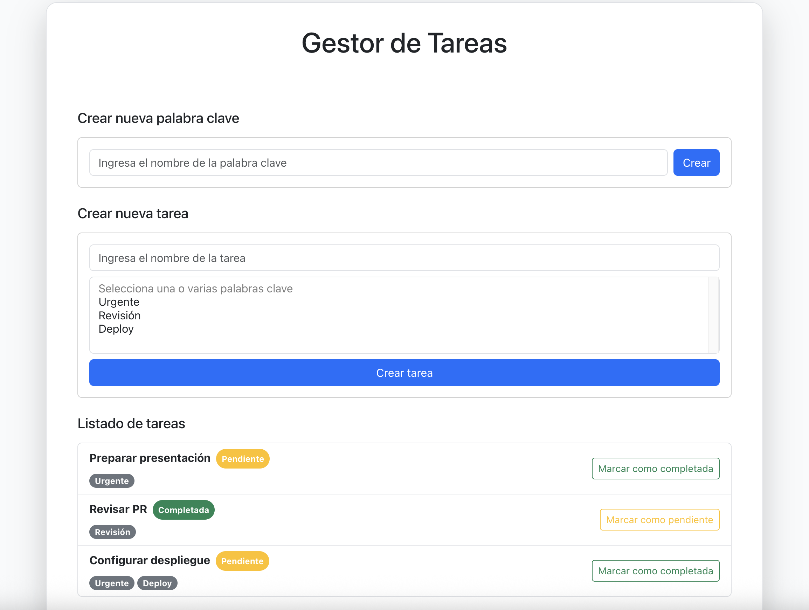
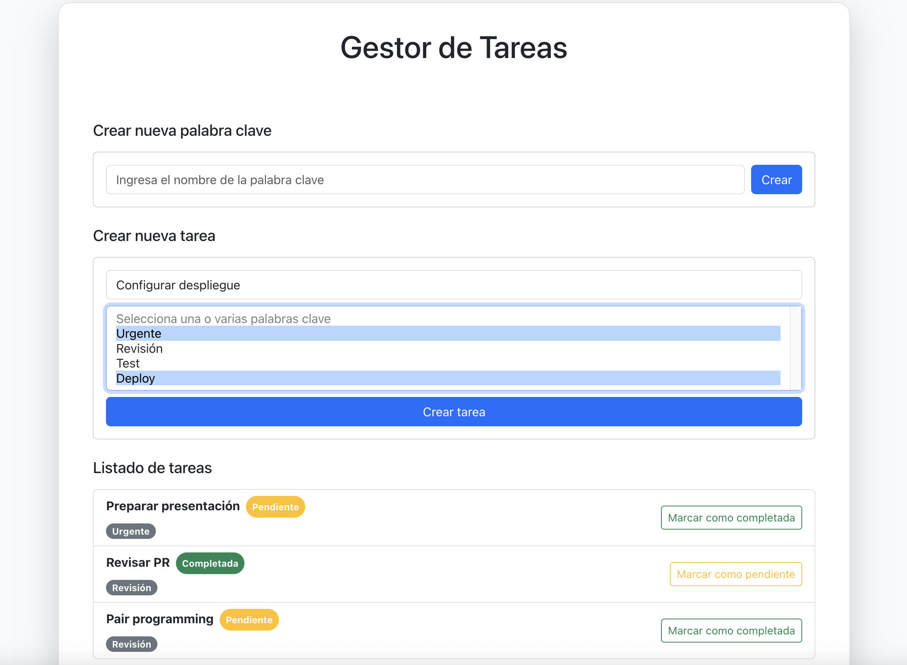

# Task Manager

Aplicación interna para gestionar tareas entre usuarios de un equipo.  
Permite crear, listar y actualizar tareas, asignarles estados (pendiente/completada) y asociarles palabras clave reutilizables.

## Requisitos

- **PHP** ^8.2
- **Composer** ^2.7
- **Laravel** ^12.x
- **MySQL** ^8.0
- **Node.js** ^22.12+
- **npm** ^10.x
- **Vue.js** ^3.5.13

## Instalación

1. **Clonar el repositorio**
   ```bash
   git clone https://github.com/judymzh94/task-manager.git
   cd taskmanager

2. **Instalar dependencias de Laravel**
   ```bash
   composer install

3. **Instalar dependencias de Node.js**
   ```bash
   npm install

4. **Configurar el archivo .env**
   
    Copiar el archivo de ejemplo y editarlo con las credenciales a la BD específicas:
   ```bash
   cp .env.example .env

5. **Crear la BD en MySQL**
   
    El nombre por defecto en el .env.example es "taskmanager"


6. **Generar la clave de la aplicación**
   ```bash
   php artisan key:generate

7. **Ejecutar las migraciones**
   ```bash
   php artisan migrate

8. **Iniciar el servidor web local**
   ```bash
   php artisan serve

8. **Compila los assets**
   ```bash
   npm run dev

## API Endpoints

- **GET** `/api/tasks` → Listar tareas con palabras clave
- **POST** `/api/tasks` → Crear nueva tarea
- **PATCH** `/api/tasks/{id}/toggle` → Cambiar estado de tarea
- **GET** `/api/keywords` → Listar palabras clave
- **POST** `/api/keywords` → Crear nueva palabra clave  

## Acceso al Dashboard de Tareas
La ruta de acceso al dashboard de gestión de tareas es el home de la aplicación "/"

##  Funcionamiento del Dashboard de Tareas

El dashboard de gestión de tareas está dividido en tres secciones principales:



1. Crear nueva palabra clave

- Ingresa un nombre de palabra clave en el campo de texto.

- Haz clic en Crear para guardarla.

2. Crear nueva tarea

    

- Escribe el título de la tarea en el campo de texto.

- Selecciona una o varias palabras clave en la lista desplegable.

- Haz clic en Crear tarea para añadirla a la lista.

3. Lista de tareas

    Cada tarea muestra:

   - Título

   - Estado (Pendiente o Completada)

   - Palabras clave asociadas

   - Botón de acción:

     - Si la tarea está **Pendiente**, verás el botón Marcar como completada.

     - Si la tarea está **Completada**, verás el botón Marcar como pendiente.

   - Estados de las tareas

     - **Pendiente** → badge gris y botón para marcar como completada.

     - **Completada** → badge verde y botón para marcar como pendiente.


